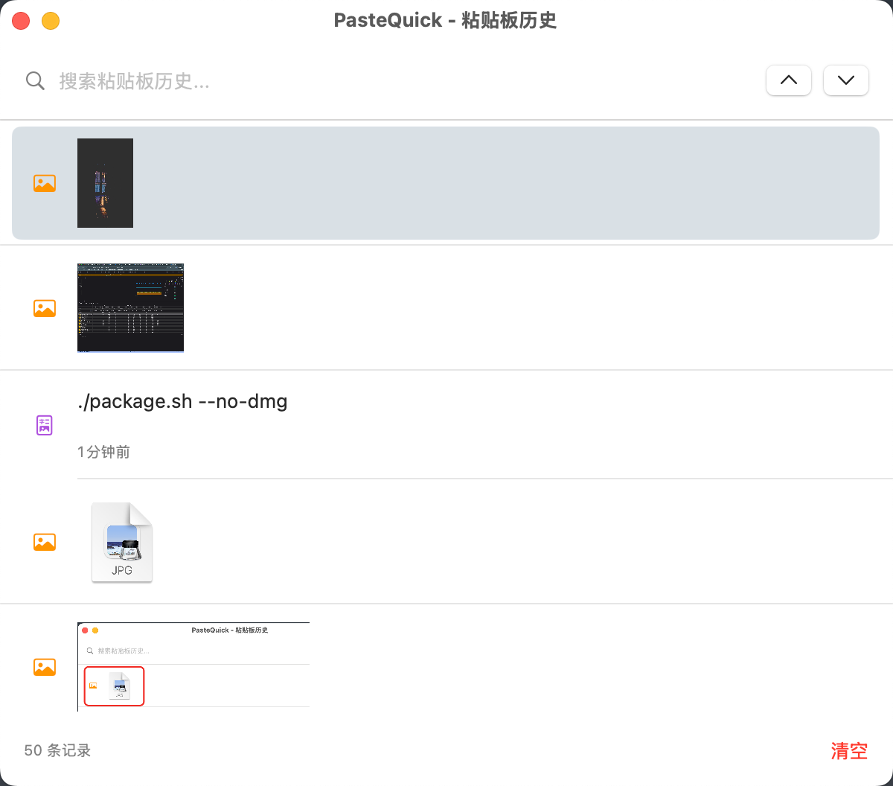
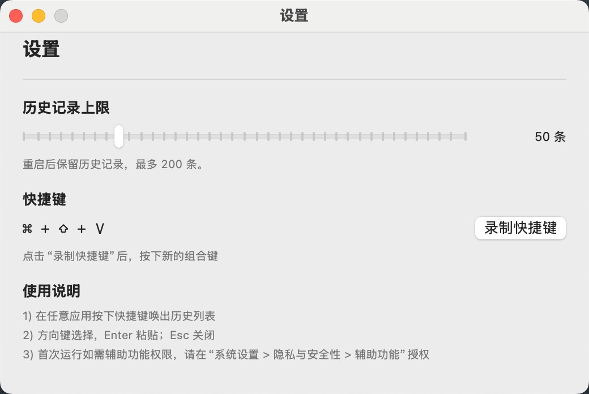

# PasteQuick - macOS 粘贴板管理应用

一个强大的 macOS 粘贴板历史管理工具，支持使用全局快捷键快速唤出粘贴板列表，并选择需要粘贴的内容。

## 功能特性

- ✅ 全局快捷键唤出（默认 `Cmd + Shift + V`）
- ✅ 粘贴板历史记录（支持最多 50 条）
- ✅ 支持多种内容类型：
  - 纯文本
  - 富文本（RTF、HTML 格式）
  - 图片（PNG、JPEG 等）
- ✅ 快速预览和搜索
- ✅ 选中后自动粘贴
- ✅ 原生 macOS 体验
- ✅ 设置页：修改历史上限、录制全局快捷键

### 截图示例


## 技术栈

- Swift 5.9+
- SwiftUI
- AppKit (NSPasteboard)
- Carbon (全局快捷键)

## 构建和运行

### 前置要求

- macOS 13.0 (Ventura) 或更高版本
- Xcode 14.0 或更高版本（包含 Swift 5.9+）
- Swift 工具链

### 使用 Swift Package Manager 构建

1. **编译应用**：
```bash
swift build -c release
```

2. **运行应用**：
```bash
swift run -c release
```

或者直接运行构建好的可执行文件：
```bash
.build/release/PasteQuick
```

3. **使用构建脚本**（推荐）：
```bash
./build.sh
```

### 打包为可安装的 .app 应用

使用提供的打包脚本创建应用包：

```bash
./package.sh
```

这会自动：
1. 从 `Sources/PasteQuick/assets/icon.jpg` 创建应用图标（如果不存在）
2. 编译应用（release 模式）
3. 创建 `PasteQuick.app` 应用包（包含图标）
4. 将应用包放到 `release/` 目录
5. 可选创建 DMG 磁盘镜像

**手动创建图标：**
```bash
./create-icon-simple.sh
```

这会从 JPG 源文件生成 macOS 应用图标（优先创建 .icns，如果失败则使用 PNG 格式）。

**安装方法：**

安装到 Applications 文件夹：
```bash
sudo cp -R release/PasteQuick.app /Applications/
```

或手动拖拽 `release/PasteQuick.app` 到 `/Applications` 文件夹。

详细安装说明请查看 [INSTALL.md](INSTALL.md)

## 使用提示

- 状态栏菜单可以打开粘贴板窗口、进入“设置…”，或退出应用
- 设置页可调整历史记录上限（10-200）并录制新的全局快捷键
- 历史记录持久化存储，重启应用仍可恢复

## 使用说明

1. 启动应用后，它会在菜单栏显示图标
2. 使用快捷键 `Cmd + Shift + V` 唤出粘贴板历史窗口
3. 使用方向键或鼠标选择要粘贴的内容
4. 按 Enter 或点击选择项即可粘贴到当前活动应用

## 配置

可以在应用设置中自定义：
- 全局快捷键
- 历史记录数量限制
- 自动启动

## 系统要求

- macOS 13.0 (Ventura) 或更高版本

